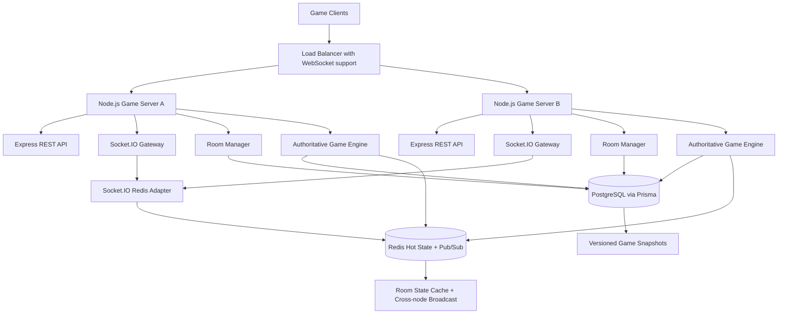

# Architecture

## Diagram

## Component Breakdown

- `Express API`: health checks and REST endpoints for players, rooms, matchmaking, ready, start, and leave.
- `Socket.IO Gateway`: realtime command channel for room/game events.
- `RoomManager`: application orchestration for create/join/match/ready/start/leave/reconnect.
- `GameCoordinator`: manages active room loops, persists snapshots, emits updates, and recovers active rooms.
- `GameEngine`: pure deterministic game rules for turns, health, energy, duplicate actions, timeouts, and game-over.
- `PostgreSQL`: durable player, room, membership, action log, and state snapshots.
- `Redis`: Socket.IO adapter pub/sub, hot game state cache, and multi-node event fanout.

## Player Limit Justification

The default room limit is 8 players. At a 10 Hz authoritative tick rate, 8 players keeps fanout bounded while still supporting free-for-all, 2v2, and 4v4 modes. Larger battle arenas should be sharded into separate room workers or zones; this service is optimized for room-scale authoritative combat.

## Scalability Strategy

Horizontal scale is achieved by running many identical Node.js game servers behind a WebSocket-capable load balancer. PostgreSQL stores durable state and action history, while Redis handles hot state and cross-server Socket.IO fanout.

Each active room is owned by one process at a time in memory. If that process crashes, another process can recover from `game_states` and resume the loop. Redis improves latency but PostgreSQL remains the recovery source of truth.

## Load Balancing

Use an L7 load balancer with WebSocket upgrade support:

- AWS ALB, NGINX, Render, Fly.io, or Kubernetes Ingress are suitable.
- Enable sticky sessions if Socket.IO polling transport remains enabled.
- For pure WebSocket transport, stickiness is less critical but still recommended during upgrades/reconnects.
- Health route: `/health`
- Readiness route: `/ready`

## Horizontal Scaling

Scale application containers by CPU, active socket count, and active room count. Socket.IO Redis adapter broadcasts room events across nodes so a player connected to server A can receive events emitted by server B.

For very large scale, add a room ownership lock in Redis, partition rooms by room id hash, and move game loops into dedicated worker pools. The current design is ready for that because the engine is pure and all commands pass through the repository/coordinator boundary.

## Server Recovery

On startup, `GameCoordinator.recoverActiveRooms()` loads rooms in `STARTING` or `IN_PROGRESS`, reads the latest `game_states` snapshot, stores it in hot state, and restarts the tick loop.

Action history is idempotent through:

- `game_actions(roomId, playerId, actionId)`
- `game_actions(roomId, playerId, seq)`
- `room_players.lastProcessedSeq`

## Client Reconnect

On join/create, the server returns a `reconnectToken`. The raw token is only returned to the client; PostgreSQL stores a SHA-256 hash. A reconnect request must include `roomId`, `playerId`, and the token. The server rebinds the new socket id, updates player status, rejoins the Socket.IO room, and returns the latest state.
